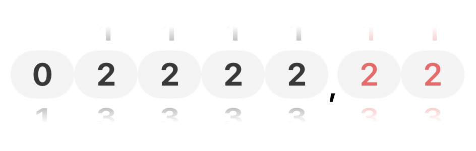
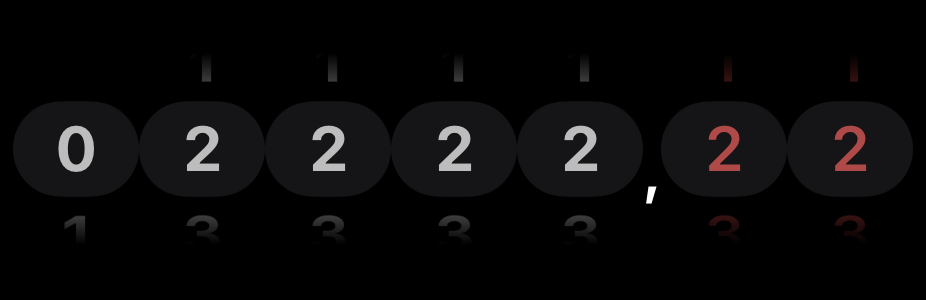

# CounterPicker

A custom SwiftUI component that replicates the behavior of mechanical counters, featuring separate displays for main digits and fractional parts.

## Overview

A scrollable wheel picker that mimics mechanical counter displays. Features separate main digits and a red fractional digit with a decimal separator, all displayed with a scroll-wheel interaction where each digit column shows the previous, current, and next values.

## Configuration

### Main Digits
- **Default:** 5 digits (0-99,999)
- **Rationale:** 5-digit configurations are the industry standard for most mechanical counters and provide a practical balance between precision and display size

### Fractional Digits (Red)
- **Default:** 1 digit (0-9)
- **Maximum:** 3 digits (0-999)
- **Rationale:** Default is set to 1 digit to keep the display compact and avoid excessive width. Since fractional digits are rarely needed, 1 digit is sufficient for most use cases. Can be adjusted up to 3 digits when higher precision is required

## Design

| Light Mode | Dark Mode |
|---|---|
|  |  |

Each digit column displays three rows (previous, current, next) creating a scroll-wheel effect. The main digits appear in dark text, the fractional digit in red, with a comma separator between them. Colors adapt to light/dark mode automatically.

## Installation

### Swift Package Manager

Add CounterPicker to your project via SPM:

```swift
dependencies: [
    .package(url: "https://github.com/oleksiikolomiietssnapp/CounterPicker.git", from: "1.0.0")
]
```

Or in Xcode: File → Add Packages → Enter repository URL.

**Requirements:**
- iOS 17.0+
- macOS 14.0+ (for testing)

## Usage

**Basic:**
```swift
@State var reading: Double = 0
CounterView(reading: $reading)
```

**Custom:**
```swift
CounterView(
    reading: $reading,
    maxWhole: 7,
    maxFraction: 3
)
```
